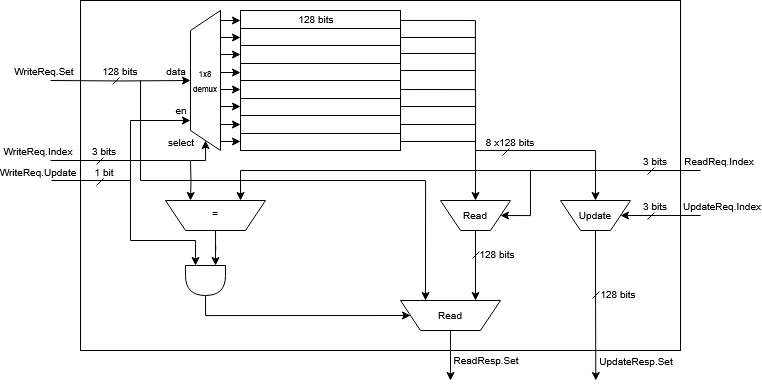
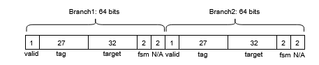
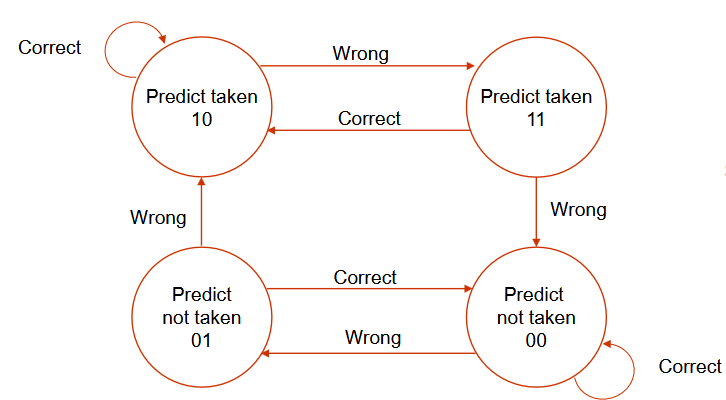
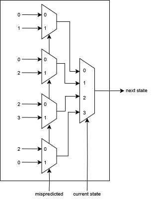

# Branch Target Buffer (BTB) with Branch Prediction

This project implements a **2-way set-associative Branch Target Buffer (BTB)** with an integrated **2-bit branch predictor** using **Chisel**, a hardware description language (HDL) that generates Verilog. The btb can store a total of **8 sets** and each set containing a max of 2 entries.

## Overview
The BTB is a crucial component in modern processors to improve branch prediction accuracy and reduce stalls in the instruction pipeline. It stores previously encountered branch targets and predicts their outcomes based on a 2-bit saturating counter.

## Features
- **2-way set-associative BTB:** Improves prediction accuracy by allowing multiple branch targets to be stored per index.
- **2-bit branch predictor:** Uses a saturating counter to predict taken/not taken branches.
- **Chisel implementation:** Written in Chisel to generate efficient Verilog for FPGA/ASIC synthesis.
- **Simulation support:** Can be tested with a set of test branches to verify correctness.

## How It Works

### 1. BTB Structure
The BTB is structured as a **2-way set-associative cache**, meaning each index can hold two branch target entries. When a branch instruction is encountered, the processor looks up the PC in the BTB:
- If a match is found (**hit**), it retrieves the predicted target address.
- If no match is found (**miss**), it fetches the branch target from memory and updates the BTB.

There is an internal module that has a set of registers along with muxes to read and write data to the btb. Then there is seperate logic attached to this block to extract all required data from our extracted data from btb. The btb internal module is shown below:



Each BTB entry contains:
- **Valid Bit:** Indicates if the entry contains valid data.
- **Tag:** The upper bits of the branch instruction address.
- **Target Address:** The address to jump to if the branch is taken.
- **Prediction Bits:** A 2-bit counter representing the branch history.

The stucture of each entry in the btb is shown below:



### 2. 2-Bit Branch Predictor
The **2-bit saturating counter** helps determine whether a branch should be taken or not. The states of the predictor are:
- **00 (Strongly Not Taken)** → Predict Not Taken
- **01 (Weakly Not Taken)** → Predict Not Taken
- **10 (Weakly Taken)** → Predict Taken
- **11 (Strongly Taken)** → Predict Taken

The 2-Bit Branch Predictor is shown below:



The predictor is implemented as an FSM using the following set of combinational logic:



### 3. BTB Lookup & Update Mechanism
- On **instruction fetch**, the BTB is checked for a matching entry.
- If an entry is found:
  - The **branch predictor** decides whether to follow the target address.
  - The processor speculatively fetches the instruction at the predicted target.
- When the branch is resolved:
  - The BTB and predictor update their state based on actual execution.
  - If mispredicted, the pipeline is flushed and corrected.

### 4. Track history in set
- A Least Recently Used (LRU) scheme is used to keep track of latest accessed branch within a set.
- It is implemented as a register of 8 bits where 0 indicated Branch1 was recently accessed and 1 indicating Branch2 was accessed.

### 5. Forwarding
If the PC value from IF stage and updatePC value from EX stage are same indicating an update to PC being fetched, there is support to pass the updated prediction directly instead of the need to wait 1 clock cycle.

## Usage
1. **Clone the repository:**
   ```sh
   git clone https://github.com/TalhaIsrar/RISCV_Branch_Target_Buffer
   cd RISCV_Branch_Target_Buffer
   ```
2. **Build the project using Chisel:**
   ```sh
   sbt run
   ```
3. **Run tests:**
   ```sh
   sbt test
   ```

## Future Enhancements
- Increase associativity (e.g., 4-way or fully associative BTB).
- Implement hybrid predictors combining local/global history.
- Optimize for FPGA synthesis and ASIC efficiency.

## License
This project is licensed under the MIT License.

